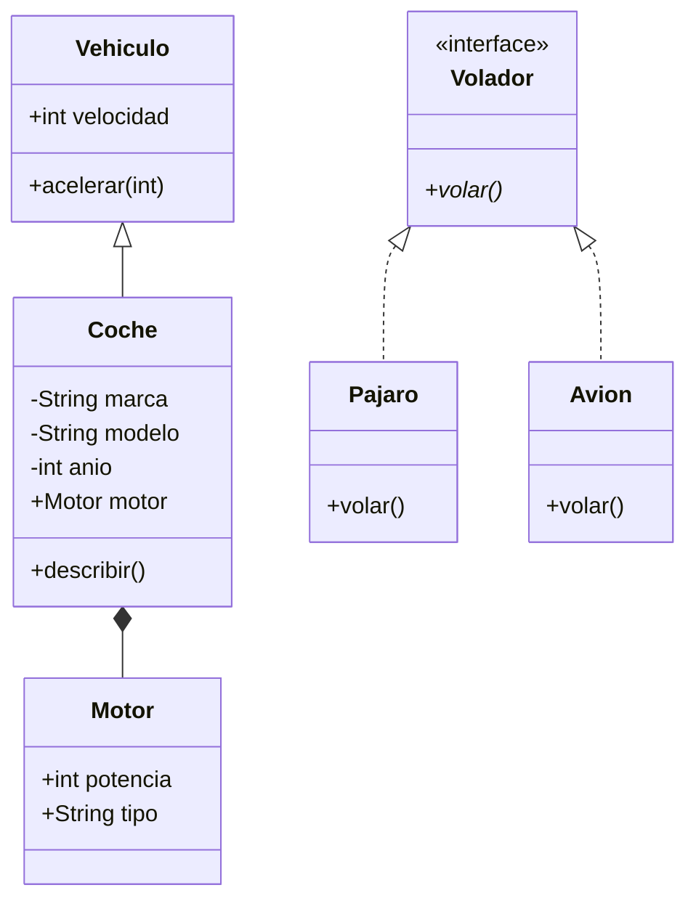
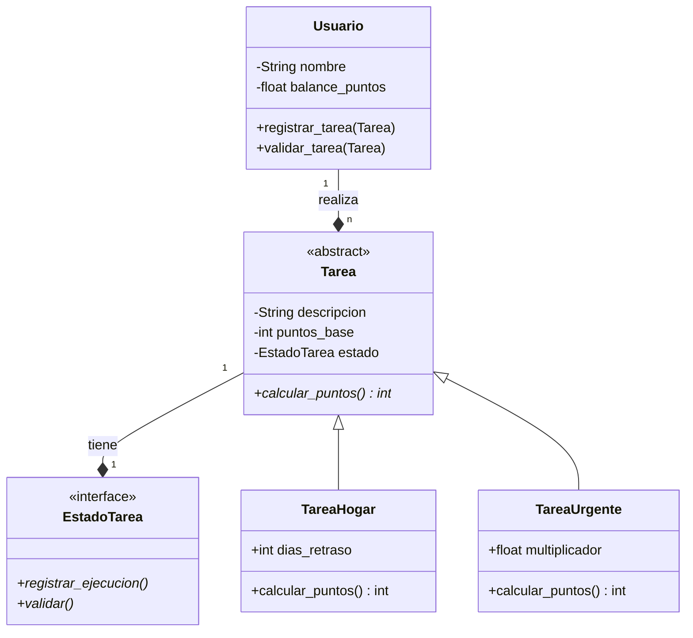

# HomeEco: Tecnología para la Convivencia 🏠💰

**Desarrollado por:** Diego Alejandro Morales  
**Institución:** Universidad de Manizales

## 🌟 Visión del Proyecto
HomeEco es un sistema de economía doméstica diseñado para resolver la repartición de tareas en el hogar mediante la tokenización del esfuerzo. Este proyecto aplica conceptos avanzados de **Programación Orientada a Objetos (POO)** para crear un entorno justo, transparente y motivador.

---

## 📊 Arquitectura y Diseño UML

A continuación se presentan los diagramas que sustentan la lógica del sistema y el proceso de aprendizaje previo.

### 1. Diagrama de Clases: Taller de Fundamentos (POO Base)
Este diagrama representa la fase inicial de aprendizaje, donde se trabajaron conceptos de herencia, interfaces y composición aplicados a una jerarquía de vehículos y animales.

*Referencia: Ejercicio 1 Taller practico, sobre pilares de la POO.*

### 2. Diagrama de Clases: HomeEco Core (POO Avanzada)
Este es el diseño principal de la aplicación actual. Implementa patrones de diseño para gestionar una economía de suma cero.

*Referencia: Arquitectura del sistema HomeEco con implementación de Patrón State y Precios Dinámicos.*

---

## 🚀 Características Técnicas Destacadas
- **Patrón State:** Los estados de las tareas (Disponible, Pendiente, Verificado) controlan la lógica de negocio de forma desacoplada.
- **Encapsulamiento Pythónico:** Uso intensivo de decoradores `@property` para la gestión de balances de puntos.
- **Suma Cero:** Algoritmo de liquidación semanal que equilibra el esfuerzo de la casa mediante compensaciones económicas.
- **Auditoría Democrática:** Sistema de validación cruzada que garantiza la integridad de los datos.

## 🛠️ Estructura del Repositorio
- `home_eco/contratos.py`: Definición de Clases Base Abstractas (ABC) y protocolos.
- `home_eco/motor.py`: Implementación de la lógica de estados y tipos de tareas.
- `home_eco/economia.py`: Cerebro algorítmico para la liquidación y reportes.
- `main_home_eco.py`: Punto de entrada con simulación y nota personal para el docente.

## 📈 Hoja de Ruta (Sprint 2 NexoSabana intergación)
- **Integración NutriSystem:** Gestión de inventario de despensa y recetas.
- **Persistencia:** Implementación de base de datos local para guardado permanente.
- **Interfaz de Usuario:** Desarrollo de una CLI interactiva o dashboard web.
